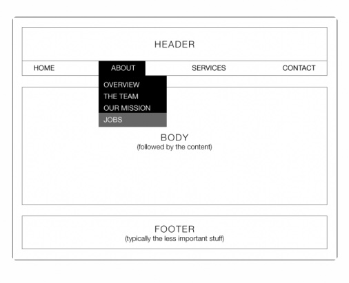

# 02-challenge-portfolio
Description
My objective was to make a portfolio website, which would grab the attention of an employer. In creating this project I discovered lots of ways to analyze a page and also design a page. Also in doing so i wanted to show future employers my various methods of my problem solving skills.Making a website comes with many hurdles and problems, in my opinion this is the best way to learn.

Features
Different Color schemes
 Links in all Descriptions 
Color Coordination
 
Usage
Improve my skill set and also get familiar with different styling. Have employers see and understand my background.

Wireframe
The design in which I modeled my work.

Credits
Abdirahman Daqane
 
